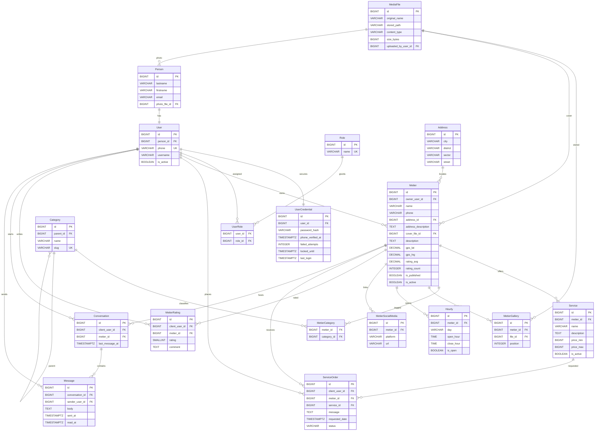

# MetierApp — Modèle de données corrigé et amélioré

## Système de base de données

- **Dev / Démo :** H2 (embarqué, mode fichier)
- **Production :** PostgreSQL
- Schéma identique géré via **Flyway** (migrations versionnées, compatibles H2 + Postgres).

---

## Corrections apportées au diagramme initial

| # | Problème d'origine | Correction |
|---|--------------------|------------|
| 1 | `User ||--o{ UserCredential` (cardinalité inversée) | `User ||--|| UserCredential` (1–1). Fusion possible, mais on garde la séparation pour isoler les secrets. |
| 2 | `Person` partagée par `User`, `Client`, `Metier` → ambiguïté d'identité | `Person` rattachée **uniquement** à `User` (1–1). Un `User` porte les rôles. `Client`/`Artisan` deviennent des profils optionnels liés à `User`. |
| 3 | Pas de gestion des rôles | Ajout `Role` + table de jointure `UserRole` (CLIENT, ARTISAN, ADMIN). |
| 4 | `Client` séparé de l'identité, pas de profil artisan explicite | Un `User` peut être client **et** artisan. `ServiceOrder`/`MetierRating` pointent vers `User` (en tant que client). |
| 5 | `gps_lat`/`gps_lng` en `INTEGER` | `DECIMAL(9,6)` — précision GPS réelle. |
| 6 | `Address` sans aucun champ, mais recherche par ville/quartier/secteur/rue | Champs ajoutés : `city`, `district` (quartier), `sector` (secteur), `street` (rue). |
| 7 | `Service` sans attribut métier | Ajout `name`, `description`, `price_min`, `price_max`, `is_active`. |
| 8 | `ServiceOrder` sans statut ni contenu | Ajout `status`, `requested_date`, `message`, `service_id` nullable (demande libre possible). |
| 9 | Messagerie WebSocket non modélisée | Ajout `Conversation` + `Message` (persistés). |
| 10 | `MetierCover` table séparée alors qu'une enseigne a UNE couverture | Couverture portée par `cover_file_id` directement sur `Metier` (1–1). `MetierGallery` conservée (1–N). |
| 11 | `MetierRating` sans contrainte d'unicité ni commentaire | Ajout `comment`, contrainte unique `(metier_id, client_user_id)` : une note par client par métier. Échelle 1–5. |
| 12 | `Category` auto-référence illimitée | Limitée à 2 niveaux par règle métier (`parent_id` null = racine, sinon sous-catégorie). |
| 13 | Pas de timestamps d'audit | `created_at` / `updated_at` sur les entités principales (via `@CreationTimestamp`/`@UpdateTimestamp`). |
| 14 | `MediaFile` vide | Ajout `original_name`, `stored_path`, `content_type`, `size_bytes`, `uploaded_by`. |
| 15 | `Hourly.day` en VARCHAR libre | `day` = enum `DayOfWeek` (MONDAY…SUNDAY). |

---

## Structure des tables (corrigée)

### User
| Name | Type | Settings |
|------|------|----------|
| **id** | BIGINT | 🔑 PK, autoincrement |
| **person_id** | BIGINT | FK → Person, not null, unique |
| **username** | VARCHAR(255) | unique, nullable |
| **phone** | VARCHAR(30) | not null, unique (identifiant de login) |
| **is_active** | BOOLEAN | not null, default true |
| **created_at** | TIMESTAMPTZ | not null |
| **updated_at** | TIMESTAMPTZ | not null |

### UserCredential
| Name | Type | Settings |
|------|------|----------|
| **id** | BIGINT | 🔑 PK |
| **user_id** | BIGINT | FK → User, not null, unique |
| **password_hash** | VARCHAR(255) | not null (BCrypt) |
| **phone_verified_at** | TIMESTAMPTZ | nullable |
| **failed_attempts** | INTEGER | not null, default 0 |
| **locked_until** | TIMESTAMPTZ | nullable |
| **last_login** | TIMESTAMPTZ | nullable |

### Role
| Name | Type | Settings |
|------|------|----------|
| **id** | BIGINT | 🔑 PK |
| **name** | VARCHAR(50) | unique (CLIENT, ARTISAN, ADMIN) |

### UserRole (jointure)
| Name | Type | Settings |
|------|------|----------|
| **user_id** | BIGINT | FK → User, PK composite |
| **role_id** | BIGINT | FK → Role, PK composite |

### Person
| Name | Type | Settings |
|------|------|----------|
| **id** | BIGINT | 🔑 PK |
| **lastname** | VARCHAR(255) | not null |
| **firstname** | VARCHAR(255) | not null |
| **email** | VARCHAR(255) | nullable, unique |
| **photo_file_id** | BIGINT | FK → MediaFile, nullable |

### Metier (enseigne / commerce de l'artisan)
| Name | Type | Settings |
|------|------|----------|
| **id** | BIGINT | 🔑 PK |
| **owner_user_id** | BIGINT | FK → User, not null |
| **name** | VARCHAR(255) | not null |
| **phone** | VARCHAR(30) | nullable |
| **address_id** | BIGINT | FK → Address, nullable |
| **address_description** | TEXT | nullable |
| **cover_file_id** | BIGINT | FK → MediaFile, nullable (1–1 couverture) |
| **description** | TEXT | nullable |
| **gps_lat** | DECIMAL(9,6) | nullable |
| **gps_lng** | DECIMAL(9,6) | nullable |
| **rating_avg** | DECIMAL(2,1) | not null, default 0 (dénormalisé pour tri/filtre note) |
| **rating_count** | INTEGER | not null, default 0 |
| **is_published** | BOOLEAN | not null, default false |
| **is_active** | BOOLEAN | not null, default true |
| **created_at** | TIMESTAMPTZ | not null |
| **updated_at** | TIMESTAMPTZ | not null |

### Address
| Name | Type | Settings |
|------|------|----------|
| **id** | BIGINT | 🔑 PK |
| **city** | VARCHAR(255) | not null (ville) |
| **district** | VARCHAR(255) | nullable (quartier) |
| **sector** | VARCHAR(255) | nullable (secteur) |
| **street** | VARCHAR(255) | nullable (rue) |

### Category
| Name | Type | Settings |
|------|------|----------|
| **id** | BIGINT | 🔑 PK |
| **parent_id** | BIGINT | FK → Category, nullable (null = racine ; 2 niveaux max) |
| **name** | VARCHAR(255) | not null |
| **slug** | VARCHAR(255) | unique |

### MetierCategory (jointure)
| Name | Type | Settings |
|------|------|----------|
| **metier_id** | BIGINT | FK → Metier, PK composite |
| **category_id** | BIGINT | FK → Category, PK composite |

### Service
| Name | Type | Settings |
|------|------|----------|
| **id** | BIGINT | 🔑 PK |
| **metier_id** | BIGINT | FK → Metier, not null |
| **name** | VARCHAR(255) | not null |
| **description** | TEXT | nullable |
| **price_min** | BIGINT | nullable (FCFA) |
| **price_max** | BIGINT | nullable (FCFA) |
| **is_active** | BOOLEAN | not null, default true |

### ServiceOrder (demande de prestation)
| Name | Type | Settings |
|------|------|----------|
| **id** | BIGINT | 🔑 PK |
| **client_user_id** | BIGINT | FK → User, not null |
| **metier_id** | BIGINT | FK → Metier, not null |
| **service_id** | BIGINT | FK → Service, nullable (null = demande libre) |
| **message** | TEXT | nullable |
| **requested_date** | TIMESTAMPTZ | nullable |
| **status** | VARCHAR(20) | not null (PENDING, ACCEPTED, REJECTED, COMPLETED, CANCELLED) |
| **created_at** | TIMESTAMPTZ | not null |
| **updated_at** | TIMESTAMPTZ | not null |

### MetierRating
| Name | Type | Settings |
|------|------|----------|
| **id** | BIGINT | 🔑 PK |
| **client_user_id** | BIGINT | FK → User, not null |
| **metier_id** | BIGINT | FK → Metier, not null |
| **rating** | SMALLINT | not null (1–5) |
| **comment** | TEXT | nullable |
| **created_at** | TIMESTAMPTZ | not null |
| | | UNIQUE (metier_id, client_user_id) |

### Conversation
| Name | Type | Settings |
|------|------|----------|
| **id** | BIGINT | 🔑 PK |
| **client_user_id** | BIGINT | FK → User, not null |
| **metier_id** | BIGINT | FK → Metier, not null |
| **created_at** | TIMESTAMPTZ | not null |
| **last_message_at** | TIMESTAMPTZ | nullable |
| | | UNIQUE (client_user_id, metier_id) |

### Message
| Name | Type | Settings |
|------|------|----------|
| **id** | BIGINT | 🔑 PK |
| **conversation_id** | BIGINT | FK → Conversation, not null |
| **sender_user_id** | BIGINT | FK → User, not null |
| **body** | TEXT | not null |
| **sent_at** | TIMESTAMPTZ | not null |
| **read_at** | TIMESTAMPTZ | nullable |

### MetierGallery
| Name | Type | Settings |
|------|------|----------|
| **id** | BIGINT | 🔑 PK |
| **metier_id** | BIGINT | FK → Metier, not null |
| **file_id** | BIGINT | FK → MediaFile, not null |
| **position** | INTEGER | nullable (ordre d'affichage) |

### MediaFile
| Name | Type | Settings |
|------|------|----------|
| **id** | BIGINT | 🔑 PK |
| **original_name** | VARCHAR(255) | not null |
| **stored_path** | VARCHAR(512) | not null (chemin relatif sur le FS) |
| **content_type** | VARCHAR(100) | not null |
| **size_bytes** | BIGINT | not null |
| **uploaded_by_user_id** | BIGINT | FK → User, nullable |
| **created_at** | TIMESTAMPTZ | not null |

> **Note de réconciliation (vs CLAUDE.md).** CLAUDE.md évoque un stockage des photos via **Cloudinary**
> (URLs seulement). C'est **cette table `MediaFile` qui fait foi** : le stockage est **local sur le
> système de fichiers du serveur**. `stored_path` contient un chemin relatif `yyyy/MM/uuid.ext` généré
> côté serveur (jamais dérivé du nom client), sous le répertoire `app.media.storage-dir`
> (`./data/media`, gitignoré). Implémenté par le package `bf.annuaire.artisans.media` : upload
> `multipart` (`POST /api/media`, JWT), download public (`GET /api/media/{id}`). Limites : images
> JPEG/PNG/WebP, ≤ 5 Mo. Conséquence assumée : binaires perdus à un redéploiement sans volume
> persistant. Pour basculer vers Cloudinary, remplacer l'implémentation de `MediaStorage` et stocker
> l'URL/public_id dans `stored_path`.

### MetierSocialMedia
| Name | Type | Settings |
|------|------|----------|
| **id** | BIGINT | 🔑 PK |
| **metier_id** | BIGINT | FK → Metier, not null |
| **platform** | VARCHAR(50) | not null (FACEBOOK, WHATSAPP, INSTAGRAM, TIKTOK, WEBSITE) |
| **url** | VARCHAR(512) | not null |

### Hourly (horaires d'ouverture)
| Name | Type | Settings |
|------|------|----------|
| **id** | BIGINT | 🔑 PK |
| **metier_id** | BIGINT | FK → Metier, not null |
| **day** | VARCHAR(10) | not null (enum DayOfWeek) |
| **open_hour** | TIME | nullable |
| **close_hour** | TIME | nullable |
| **is_open** | BOOLEAN | not null, default true |
| | | UNIQUE (metier_id, day) |

### DeviceToken (push mobile)
| Name | Type | Settings |
|------|------|----------|
| **id** | BIGINT | 🔑 PK |
| **user_id** | BIGINT | FK → User, not null |
| **token** | VARCHAR(512) | not null, unique (token FCM) |
| **platform** | VARCHAR(10) | not null (ANDROID, IOS) |
| **created_at** | TIMESTAMPTZ | not null |
| **last_seen_at** | TIMESTAMPTZ | nullable |

### RefreshToken (révocation JWT mobile)
| Name | Type | Settings |
|------|------|----------|
| **id** | BIGINT | 🔑 PK |
| **user_id** | BIGINT | FK → User, not null |
| **token_hash** | VARCHAR(255) | not null, unique (hash du refresh token) |
| **expires_at** | TIMESTAMPTZ | not null |
| **revoked_at** | TIMESTAMPTZ | nullable |
| **created_at** | TIMESTAMPTZ | not null |

---

## Relations

- `Person` 1–1 `User`
- `User` 1–1 `UserCredential`
- `User` N–N `Role` (via `UserRole`)
- `User` 1–N `Metier` (en tant que owner / artisan)
- `User` 1–N `ServiceOrder` (en tant que client)
- `User` 1–N `MetierRating` (en tant que client)
- `Metier` 1–N `Service`
- `Metier` 1–1 `Address`  *(N–1 : plusieurs métiers peuvent partager une adresse)*
- `Metier` N–N `Category` (via `MetierCategory`)
- `Category` 1–N `Category` (auto-réf, 2 niveaux)
- `Metier` 1–N `MetierGallery` 1–1 `MediaFile`
- `Metier` 1–1 `MediaFile` (couverture, via `cover_file_id`)
- `Metier` 1–N `Hourly`
- `Metier` 1–N `MetierSocialMedia`
- `Metier` 1–N `MetierRating`
- `Metier` 1–N `ServiceOrder`
- `Service` 1–N `ServiceOrder`
- `Metier` 1–N `Conversation` 1–N `Message`

---

## Diagramme Mermaid

